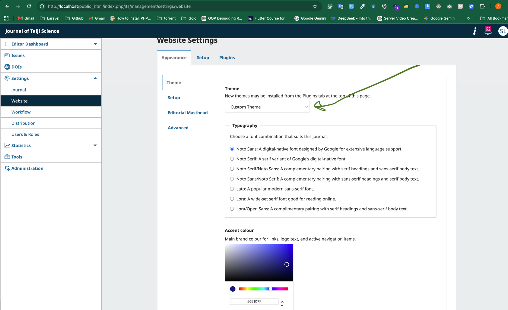
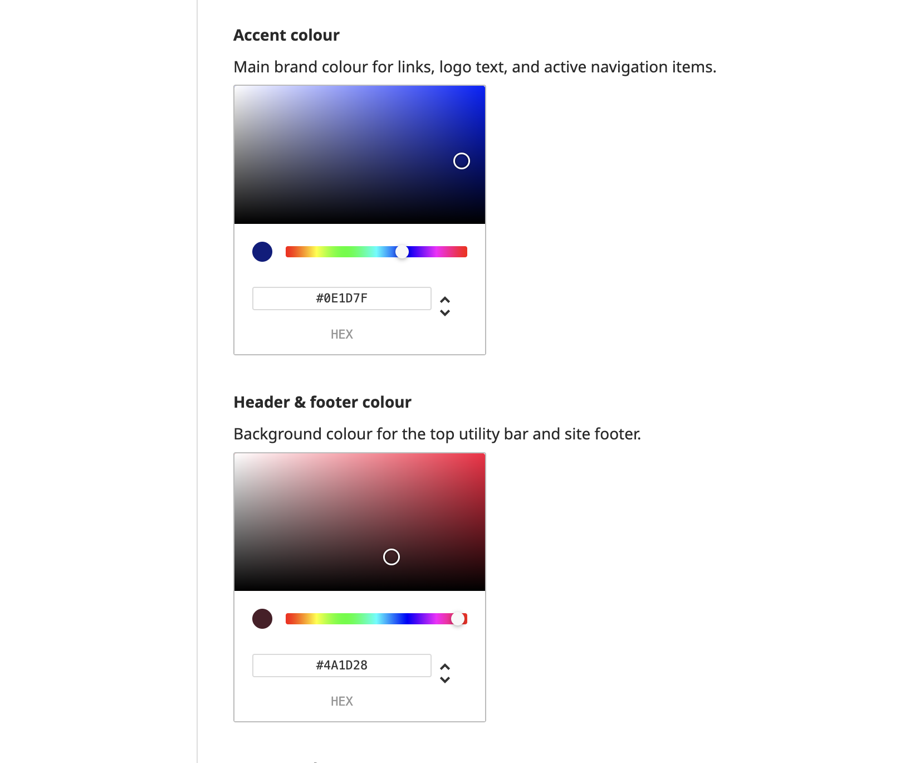
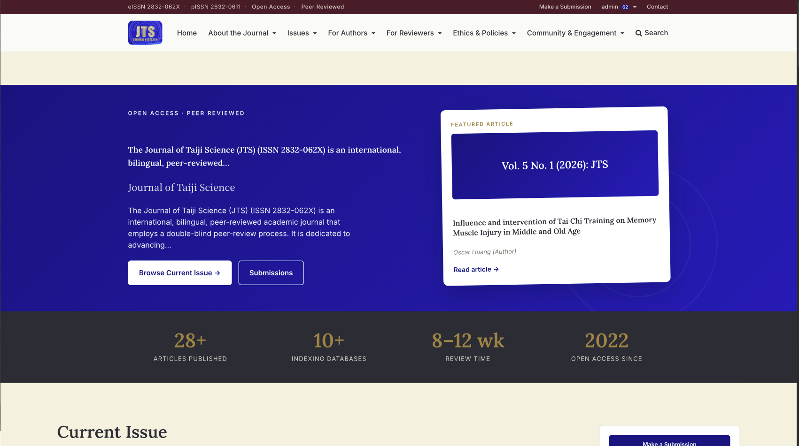
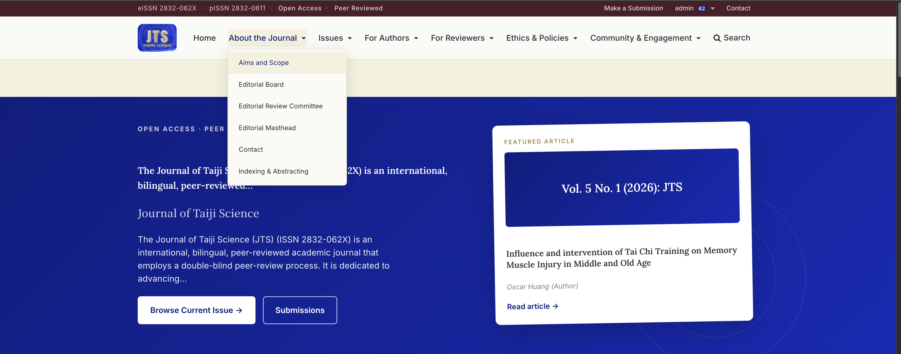
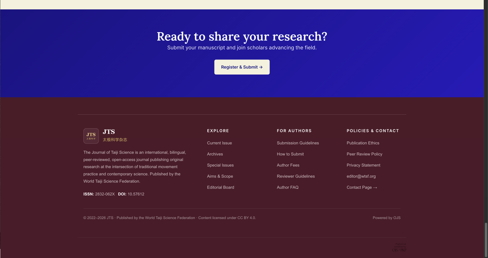

# Custom Theme — User Guide

A visual guide for journal managers and site administrators. You do not need any technical knowledge — everything below explains **where to change settings in the dashboard** and **what each part of the public website looks like as a result**.

Screenshots are **embedded directly in this file** (see images below each section). The PNG files sit in **this same folder** as this guide.

**To preview images in Cursor:** open this file, then press **Cmd+Shift+V** (Mac) or **Ctrl+Shift+V** (Windows) to open **Markdown Preview** — the raw editor tab alone does not show images.

---

## How this guide works

Each section of the live site is shown in a screenshot. For every area we tell you:

| Label | Meaning |
|---|---|
| **Set by admin** | You control this in **Settings → Website → Appearance** (theme options). |
| **Fixed in theme** | Built into the theme design. Cannot be changed from the colour pickers. |
| **Content from OJS** | Text, articles, and images come from normal journal setup — not from the theme colour settings. |

The theme gives you **two colour pickers**. Almost everything else (cream page backgrounds, gold stat numbers, light footer text, and so on) stays as designed so the site stays readable and consistent.

---

## Step 1 — Open the theme settings

1. Log in to the **Journal Dashboard**
2. In the left sidebar, open **Settings → Website**
3. Click the **Appearance** tab at the top
4. Under the **Theme** heading on the left, make sure **Custom Theme** is selected in the dropdown
5. Scroll down to see **Typography**, **Accent colour**, **Header & footer colour**, and other options
6. Click **Save** when you are finished

**What you see in this screenshot**

- **Theme dropdown (green arrow in image):** Must be set to **Custom Theme** for this guide to apply. Other themes have different options.
- **Typography:** Set by admin — choose which fonts are used for headings and body text (see [Other theme settings](#other-theme-settings-brief) below).
- **Accent colour:** Set by admin — your main brand colour. The picker and hex field (e.g. `#8E1D7F`) control how this colour appears on the public site.

---

## Step 2 — The two colours you control

These are the only two background/brand colours you can change from the dashboard. Everything else on the site either uses fixed palette colours or derives lighter shades automatically from your accent colour.

### Accent colour

**Admin setting:** *Accent colour*  
**Description in dashboard:** *Main brand colour for links, logo text, and active navigation items.*

**Set by admin — used for:**

- Homepage hero banner background (large blue/purple band in the example)
- “Submit manuscript” / call-to-action banner at the bottom of the homepage
- Text links across the site (“Read article →”, “Browse issue”, etc.)
- Buttons (Submit, Download, Make a Submission, and similar)
- Logo text when no image logo is uploaded
- Menu links on hover and the underline on the active page
- Search icon and mobile menu button
- Featured article card inner cover block and link accents
- Section heading accents, borders, and sidebar highlights

The theme also **automatically lightens** your accent colour slightly for hover states and gradients — you do not set that separately.

### Header & footer colour

**Admin setting:** *Header & footer colour*  
**Description in dashboard:** *Background colour for the top utility bar and site footer.*

**Set by admin — used for:**

- Background of the **top utility bar** (thin strip at the very top with ISSN, Open Access, login links)
- Background of the **site footer** (dark band at the bottom with journal info and links)
- Login / Register dropdown menu background when opened from the top bar

**Not** used for the main navigation bar (logo + menu row) — that bar stays cream unless you enable the optional header background image.

---

## Step 3 — Walk through the live site (top to bottom)

The screenshot below shows the **journal homepage** from top to bottom: utility bar, navigation, hero, and stats row. Read each numbered area and match it to the admin settings above.

---

### ① Top utility bar (very top strip)

The narrow dark strip at the top. It shows ISSN numbers, “Open Access”, “Peer Reviewed”, “Make a Submission”, login/account links, and Contact.

| Element | Who controls it |
|---|---|
| **Background colour** | **Set by admin** — *Header & footer colour* |
| ISSN, labels, link text | Fixed in theme (light text on dark background) |
| Link text content | Content from OJS (journal setup, user account) |
| Notification badge highlights | **Set by admin** — *Accent colour* |

*See the very top dark band in the homepage screenshot above.*

---

### ② Navigation bar (logo + main menu)

The cream/off-white row below the utility bar: journal logo, Home, About, Issues, For Authors, Search, and so on.

| Element | Who controls it |
|---|---|
| **Bar background** | **Fixed in theme** — cream (`#f5f1e8` style). Not changed by either colour picker. |
| **Optional image background** | **Set by admin** — turn on *“Show the homepage image as the header background”* to use your uploaded homepage image behind this bar. |
| Logo image | Content from OJS — upload under **Settings → Website → Appearance → Setup** |
| **Logo text colour** (if no image) | **Set by admin** — *Accent colour* |
| **Menu links — hover & active underline** | **Set by admin** — *Accent colour* |
| **Search icon / mobile menu** | **Set by admin** — *Accent colour* |
| Menu item labels & structure | Content from OJS — **Settings → Website → Setup → Navigation** |

In this screenshot the **About the Journal** menu is open. The dropdown panel uses a light background (fixed in theme); the active menu item’s underline comes from your **Accent colour**.

---

### ③ Hero banner (homepage only)

The large coloured section under the menu with the journal title, description, action buttons, and the featured article card on the right.

| Element | Who controls it |
|---|---|
| **Banner background gradient** | **Set by admin** — *Accent colour* |
| Journal title, tagline, body text | Content from OJS — journal name, summary, homepage text |
| “Browse Current Issue” / “Submissions” buttons | **Accent colour** shapes button styling; button labels from OJS |
| Featured article card (white box) | Fixed in theme (white card on coloured banner) |
| **“FEATURED ARTICLE” label** | **Fixed in theme** — antique gold accent (not the admin accent picker) |
| **Cover block inside card** (volume/issue strip) | **Set by admin** — *Accent colour* |
| **“Read article →” link** | **Set by admin** — *Accent colour* |
| Article title & author | Content from OJS — current issue / featured article |

This section appears **only on the journal homepage**, not on inner pages.

---

### ④ Stats strip (homepage only)

The dark horizontal band with four numbers: articles published, indexing databases, review time, open-access since year.

*In the screenshot above, look at the dark row just below the blue hero — the four gold numbers and white labels.*

| Element | Who controls it |
|---|---|
| **Strip background** | **Fixed in theme** — dark charcoal (not Header & footer colour) |
| **Large numbers** (e.g. “28+”, “8–12 wk”) | **Fixed in theme** — antique gold |
| **Labels** under numbers | **Fixed in theme** — light grey uppercase text |
| **Review time text** (e.g. “8–12 wk”) | **Set by admin** — *Homepage review time stat* (text only, not colour) |
| **Indexing count** | Pulled from OJS data + admin *Indexed databases* list |
| Other stat values | Content from OJS (article counts, journal start year) |

Neither colour picker changes this row — it is intentionally fixed so statistics stay easy to read on every journal.

---

### ⑤ Main content area (all pages)

Everything below the header: current issue, recent articles, editorial board, announcements, article pages, issue pages, About pages, and archives.

| Element | Who controls it |
|---|---|
| **Page background** | **Fixed in theme** — cream/off-white |
| **Body text colour** | **Fixed in theme** — dark grey |
| **Links** | **Set by admin** — *Accent colour* |
| **Buttons** (Submit, Download, Browse, etc.) | **Set by admin** — *Accent colour* |
| **Section borders & heading accents** | **Set by admin** — *Accent colour* |
| Issue cards, archive banners, sidebar block titles | **Accent colour** for highlights; layout fixed in theme |
| Articles, issues, board members, announcements | Content from OJS |

*The cream “Current Issue” section at the bottom of the homepage screenshot above is an example of this area.*

---

### ⑥ Footer & bottom call-to-action (every page)

The screenshot below shows the **“Ready to share your research?”** banner (homepage) and the **footer** with four columns of links.

#### Call-to-action banner (homepage)

| Element | Who controls it |
|---|---|
| **Banner background** | **Set by admin** — *Accent colour* (same gradient family as the hero) |
| Heading & subheading text | Fixed in theme (white text) + content from OJS |
| “Register & Submit” button | Fixed cream button style; sits on accent background |

#### Site footer

| Element | Who controls it |
|---|---|
| **Footer background** | **Set by admin** — *Header & footer colour* |
| Footer text & links | **Fixed in theme** — light cream/white for readability (not Accent colour) |
| Logo, description, ISSN, link lists | Content from OJS — journal setup, navigation, static pages |
| “Powered by OJS” | Fixed in theme |

---

## Quick reference — which admin setting affects what

<table class="quick-ref">
<thead>
<tr>
<th class="quick-ref-area">Area on the website</th>
<th class="quick-ref-check">Header &amp; footer colour</th>
<th class="quick-ref-check">Accent colour</th>
<th class="quick-ref-check">Fixed in theme</th>
</tr>
</thead>
<tbody>
<tr><td class="quick-ref-area">Top utility bar background</td><td class="quick-ref-check">✓</td><td class="quick-ref-check"></td><td class="quick-ref-check"></td></tr>
<tr><td class="quick-ref-area">Top bar notification badges</td><td class="quick-ref-check"></td><td class="quick-ref-check">✓</td><td class="quick-ref-check"></td></tr>
<tr><td class="quick-ref-area">Navigation bar background</td><td class="quick-ref-check"></td><td class="quick-ref-check"></td><td class="quick-ref-check">✓ (cream)*</td></tr>
<tr><td class="quick-ref-area">Logo / menu hover &amp; active</td><td class="quick-ref-check"></td><td class="quick-ref-check">✓</td><td class="quick-ref-check"></td></tr>
<tr><td class="quick-ref-area">Homepage hero banner</td><td class="quick-ref-check"></td><td class="quick-ref-check">✓</td><td class="quick-ref-check"></td></tr>
<tr><td class="quick-ref-area">Featured card gold label</td><td class="quick-ref-check"></td><td class="quick-ref-check"></td><td class="quick-ref-check">✓</td></tr>
<tr><td class="quick-ref-area">Homepage stats row</td><td class="quick-ref-check"></td><td class="quick-ref-check"></td><td class="quick-ref-check">✓</td></tr>
<tr><td class="quick-ref-area">Page content backgrounds</td><td class="quick-ref-check"></td><td class="quick-ref-check"></td><td class="quick-ref-check">✓</td></tr>
<tr><td class="quick-ref-area">Links, buttons, highlights</td><td class="quick-ref-check"></td><td class="quick-ref-check">✓</td><td class="quick-ref-check"></td></tr>
<tr><td class="quick-ref-area">Homepage CTA banner</td><td class="quick-ref-check"></td><td class="quick-ref-check">✓</td><td class="quick-ref-check"></td></tr>
<tr><td class="quick-ref-area">Footer background</td><td class="quick-ref-check">✓</td><td class="quick-ref-check"></td><td class="quick-ref-check"></td></tr>
<tr><td class="quick-ref-area">Footer link text colour</td><td class="quick-ref-check"></td><td class="quick-ref-check"></td><td class="quick-ref-check">✓</td></tr>
</tbody>
</table>

\*Optional homepage image background is a separate admin toggle, not a colour picker.

---

## Other theme settings (brief)

These settings do **not** replace the two colour pickers, but they change content or layout on the public site:

| Setting | What it does | Set by admin? |
|---|---|---|
| **Typography** | Font pairing for headings and body text across the site | ✓ |
| **Show the journal summary on the homepage** | Shows or hides the journal description in the hero area | ✓ |
| **Header background image** | Uses your homepage upload as the navigation bar background | ✓ |
| **Usage statistics display** | Shows or hides download charts on article pages | ✓ |
| **Homepage review time stat** | Text in the stats row (e.g. `8–12 wk`) — colour stays gold | ✓ (text) |
| **Indexed databases** | Names listed in the indexing section on the homepage | ✓ (text) |
| **Recent articles count** | How many recent articles appear on the homepage (1–12) | ✓ |
| **Editorial team preview count** | How many editors are listed on the homepage | ✓ |

*Scroll down on the same Appearance page to reach Typography, colour pickers, and the homepage options listed above.*

---

## Tips for choosing colours

- **Header & footer colour** and **Accent colour** work best when they are related shades of the same brand — for example a dark maroon header/footer (`#4A1D28`) with a brighter burgundy or blue accent (`#6D2D3D` or `#0E1D7F`).
- The accent is usually **lighter or more vivid** than the header/footer colour so links and buttons stand out on cream backgrounds.
- After saving, **refresh the public site** in your browser. Use a hard refresh if colours look stale: **Ctrl+F5** (Windows) or **Cmd+Shift+R** (Mac).
- Colours must be valid **hex codes** starting with `#`, e.g. `#6d2d3d`. Invalid values are ignored and the theme falls back to its defaults.
- Typography changes apply site-wide immediately after save; you do not need to republish content.

---

## Image files in this folder

This guide and all screenshots live together in `plugins/themes/custom/Screenshot/`:

| File | Used for |
|---|---|
| `THEME-GUIDE.md` | This guide |
| `01-appearance-settings.png` | Finding theme settings in the dashboard |
| `02-colour-pickers.png` | Accent colour vs Header & footer colour |
| `03-homepage-top.png` | Homepage — top bar through stats strip |
| `04-homepage-footer.png` | Homepage CTA banner and footer |
| `05-navigation-dropdown.png` | Navigation bar and dropdown menu |

Replace the PNG files with your own journal screenshots anytime; keep the same filenames if you want this guide’s images to keep working.
